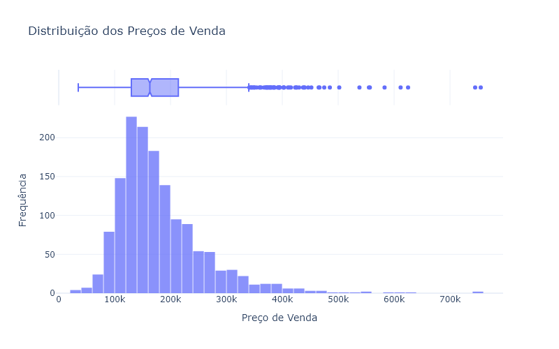
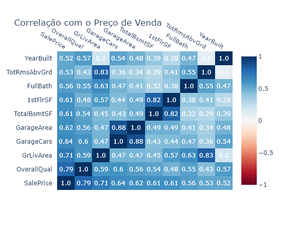
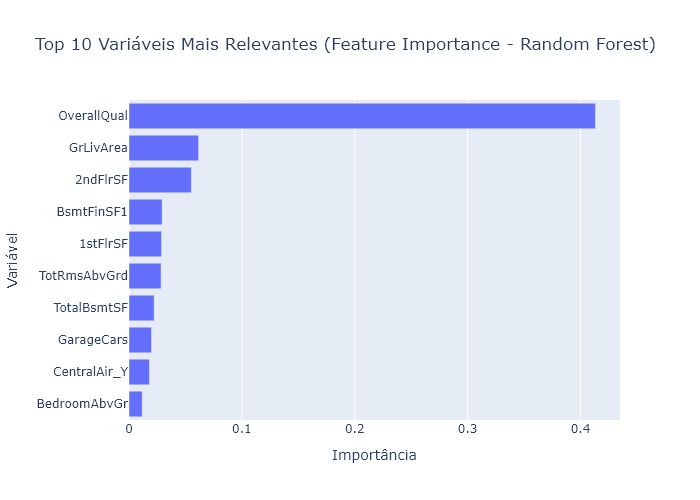

# Previsor de preços de imóveis

### 🧾 Objetivo do Projeto

Prever o preço de imóveis residenciais com base em características como localização, número de quartos, área construída, etc. O objetivo é demonstrar como um modelo de regressão pode apoiar decisões de compra, venda ou avaliação de imóveis.

---

### ⚙️Criando env

```
conda create --name cases_data_science python=3.10
conda activate cases_data_science
```

Se precisar deletar env

```
conda remove --name cases_data_science --all
```

Exportar notebook para md

```
jupyter nbconvert notebook.ipynb --to markdown --no-input

```

---

### 🔍 Fonte dos Dados

Usaremos o **Ames Housing Dataset** , disponível publicamente no [OpenML]() ou por meio do pacote `sklearn.datasets`.

```
from sklearn.datasets import fetch_openml

```

---

### 📁 Estrutura de Pastas e Arquivos

```
realestate-price-predictor/
│
├── data/
│   ├── raw/                # Dados originais
│   └── processed/          # Dados tratados
│
├── notebooks/
│   ├── 01_eda.ipynb        # Análise exploratória
│   ├── 02_preprocessing.ipynb  # Limpeza e engenharia de variáveis
│   ├── 03_modeling.ipynb       # Treinamento e avaliação de modelos
│
├── requirements.txt        # Bibliotecas necessárias
├── README.md               # Documentação do projeto
└── .gitignore

```

---

### ⚙️ Etapas do Processo

1. **Coleta de dados**

   A partir do `sklearn.datasets.fetch_openml('house_prices')`.

2. **Limpeza e pré-processamento**

   - Tratar valores nulos
   - Encoding de variáveis categóricas
   - Feature selection

3. **Análise exploratória**

   - Correlações com preço
   - Histograma e distribuições
   - Visualizações geográficas (se houver)

4. **Modelagem**

   - Regressão Linear
   - Random Forest
   - XGBoost (opcional)

5. **Avaliação e explicação**

   - RMSE, MAE
   - SHAP ou Permutation Importance

---

### ⚙️ Como Executar Localmente

1. Clone o repositório:

```
git clone https://github.com/seunome/realestate-price-predictor.git
cd realestate-price-predictor
```

2. Crie um ambiente virtual (opcional) e instale as dependências:

```
pip install -r requirements.txt
```

3. Inicie os notebooks:
   ```
   jupyter notebook
   ```

Execute os notebooks em ordem para visualizar todo o pipeline.

---

### 📊 Salvar gráficos

Plotly precisa da biblioteca **kaleido** para exportar gráficos como imagem:

```
pip install -U kaleido
```

---

## ✅ Resultados

### 📊 Distribuição dos Preços de Venda

A análise da distribuição dos preços de venda revela um comportamento assimétrico à direita, indicando que a maior parte das propriedades é comercializada por valores mais baixos, enquanto uma minoria atinge preços significativamente elevados.

Esse padrão sugere a presença de **outliers** e **distribuição não normal** , o que pode influenciar negativamente o desempenho de modelos lineares. Estratégias como transformação logarítmica ou modelagem robusta podem ser consideradas para mitigar esse efeito.



### 🔍 Correlação com o Preço de Venda

A análise de correlação permite identificar as variáveis com maior impacto direto no valor do imóvel. Entre os atributos com **maior correlação positiva** com o `SalePrice`, destacam-se:

- **OverallQual** (qualidade geral da construção)
- **GrLivArea** (área habitável acima do solo)
- **GarageCars** e **GarageArea** (quantidade de vagas e área de garagem)

Esses fatores são consistentes com o que se espera no mercado imobiliário e devem ser priorizados na seleção de features para modelos de regressão.



### 🤖 Avaliação dos Modelos

Foram testados dois algoritmos de regressão: **Regressão Linear** e **Random Forest Regressor** . A tabela abaixo resume os principais resultados de desempenho no conjunto de teste:

| Modelo           | RMSE | R²   |
| ---------------- | ---- | ---- |
| Regressão Linear | 0.62 | 0.68 |
| Random Forest    | 0.37 | 0.89 |

O modelo de **Random Forest** apresentou desempenho superior em ambas as métricas, mostrando-se mais eficiente na captura de não-linearidades e interações complexas entre variáveis.

---

### ⭐ Top 10 Variáveis Mais Relevantes (Random Forest)

A seguir, as 10 features com maior importância segundo o modelo Random Forest:

| Variável    | Importância |
| ----------- | ----------- |
| OverallQual | 0.559       |
| GrLivArea   | 0.122       |
| 2ndFlrSF    | 0.034       |
| TotalBsmtSF | 0.034       |
| BsmtFinSF1  | 0.030       |
| 1stFlrSF    | 0.027       |
| LotArea     | 0.018       |
| GarageArea  | 0.016       |
| YearBuilt   | 0.013       |
| GarageCars  | 0.012       |

Essas variáveis explicam boa parte da variância no preço dos imóveis e foram decisivas para o desempenho preditivo do modelo.


